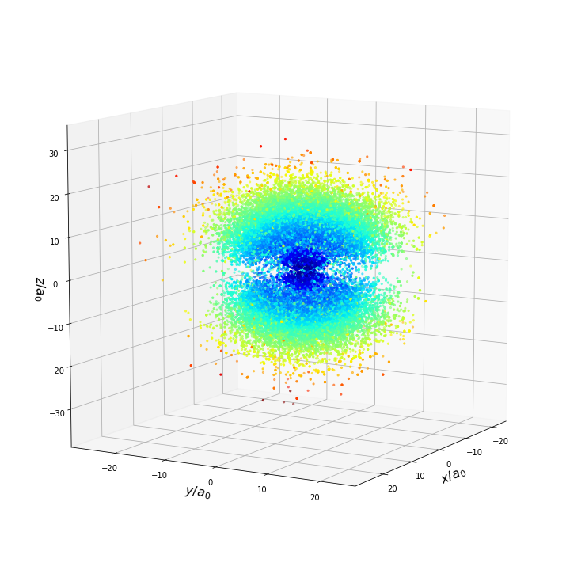

# LSN Exercise Delivery Repository

Repository created to deliver the exercises for the subject "Laboratorio di Simulazione Numerica" of the University of Milan's Physics Department.


## Requirements

- Linux OS (developed with Ubuntu 18.10)
- g++ C++ compiler
- Python 3.* with _numpy_, _scipy_, _maplotlib_, _keras_ and _tensorflow_ modules installed 
- Jupyter Notebook

## Usage

In general, each folder contains the C++ code plus two IPython notebooks, one with the exercises named "LSN_Exercises_##" plus one with the solutions called "esercitazione#", where # is the exercise number.

To view the solutions, compile the C++ code and execute all the .exe files generated with:
  ```bash
  cd [exercise session directory]
  make
  ./esercizio[...].exe
 ```
From Exercise 4 onwards, due to the incresing complexity of the simulations it may be required to launch a simulation script such as:
  ```bash
  ./simulate.sh
  ```

The raw data will be stored in conveniently named _.csv_, _.out_ or _.dat_ files, located either in the root folder of the exercise or within a dedicated _sim_data_ folder. 

To view the simulation results, execute all the commands within the notebook in order (many variable names are reused for convenience).


## Exercises

- [FINAL] Exercise 1: Testing the RNG, generating distributions, Buffon's experiment.
- [FINAL] Exercise 2: Monte Carlo integration, importance sampling
- [FINAL] Exercise 3: European option Call/Put price prediction with Monte Carlo methods.
- Exercise 4: Molecular Dynamics simulation using the Lennard-Jones model plus a Verlet algorithm.
- [FINAL] Exercise 5: Sampling hidrogenic wave functions with the Metropolis algorithm.
- [FINAL] Exercise 6: 1-D Ising Model Monte Carlo simulation.
- Exercise 7: Molecular Dynamics simulation using the Lennard-Jones model plus the Metropolis algorithm.
- Exercise 8: Variational Ground-State Optimization using the Metropolis algorithm.
- Exercise 9: Developing a Genetic Algorithm for the Traveling Salesman Problem.
- Exercise 10: Simmulated Annealing applied to the Traveling Salesman Problem.
- [FINAL] Exercise 11: Application of simple Feedforward Neural Networks with Keras.
- [FINAL] Exercise 12: Image Recognition with Convolutional Neural Networks

<p align="center"> 

</p>
<p align="center"> 
Sampling of the Hydrogen Wavefunction's D base state via the Metropolis Algorithm.
</p>
